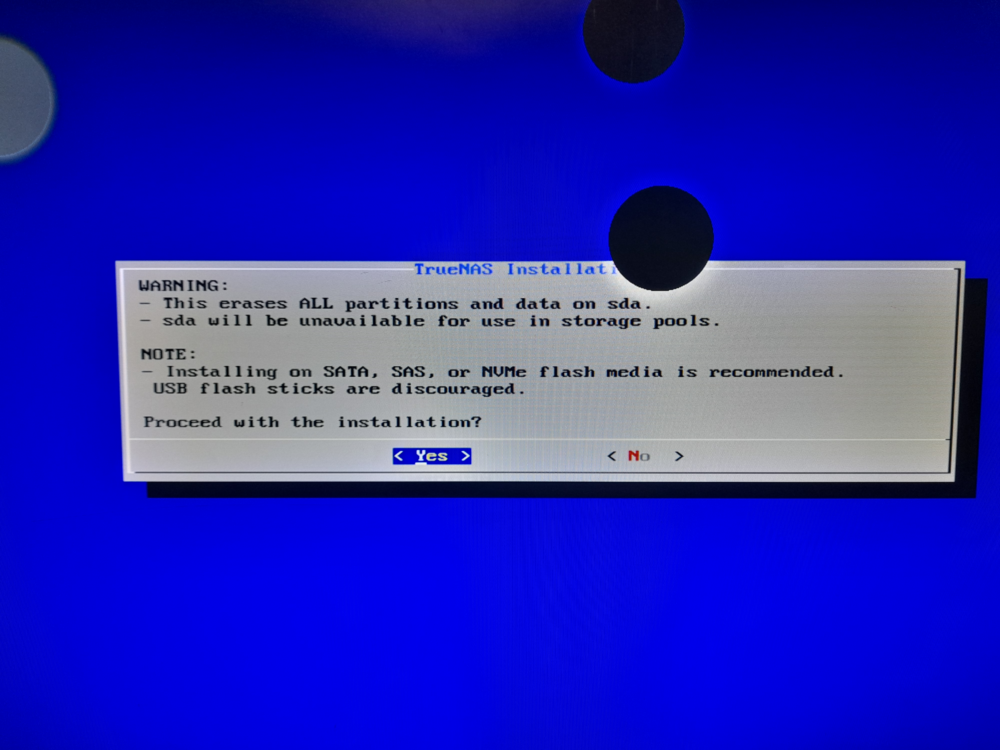
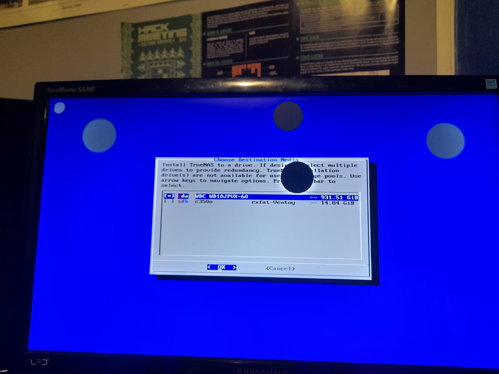
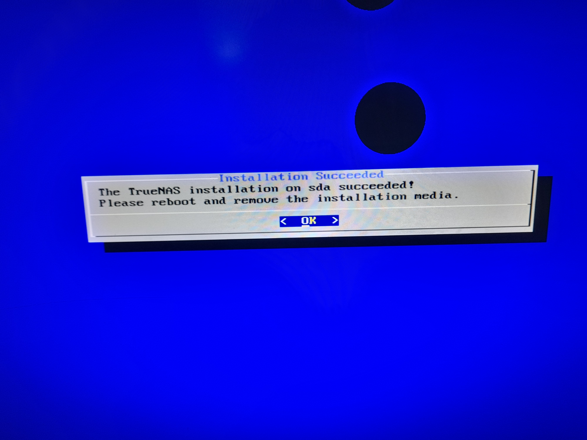
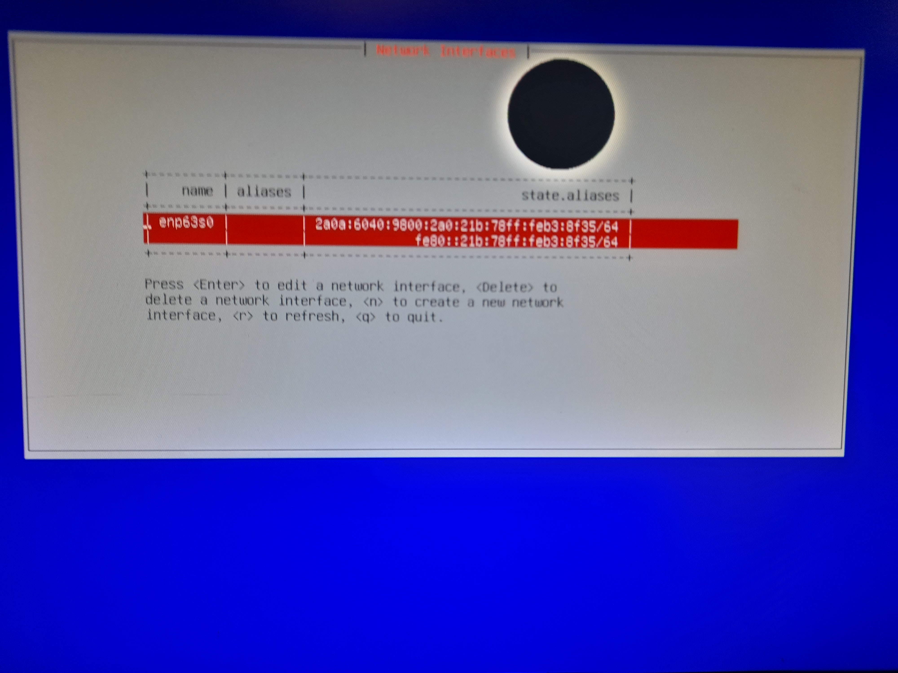

## Parte 1 - Instalación y configuración inicial

### Descripción

En este ejercicio se aprenderá el proceso de instalación y configuración inicial de TrueNAS, incluyendo los requisitos mínimos del sistema, la preparación del medio de instalación y los pasos necesarios para realizar una instalación limpia. También se configurarán los parámetros básicos del sistema como red, almacenamiento y servicios esenciales.

### Requisitos del sistema

### Instalación

### Configuración inicial

### Interfaz web

**Referencias:**

1. Guía de instalación de TrueNAS:
   [https://www.truenas.com/docs/scale/scaletutorials/install/](https://www.truenas.com/docs/scale/scaletutorials/install/)

2. Requisitos del sistema TrueNAS:
   [https://www.truenas.com/docs/scale/gettingstarted/sysreqs/](https://www.truenas.com/docs/scale/gettingstarted/sysreqs/)