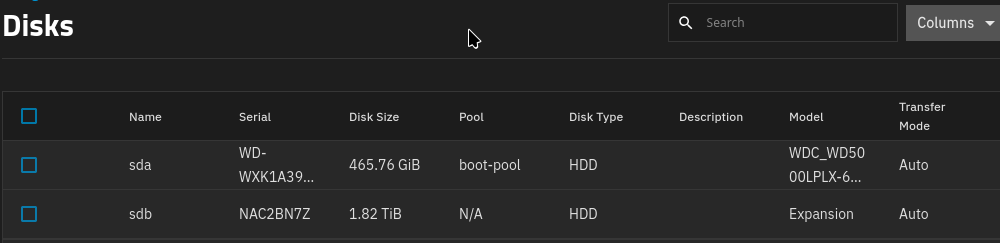
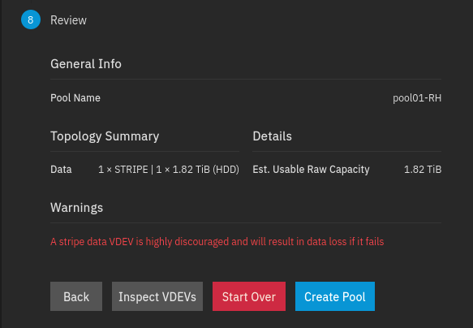
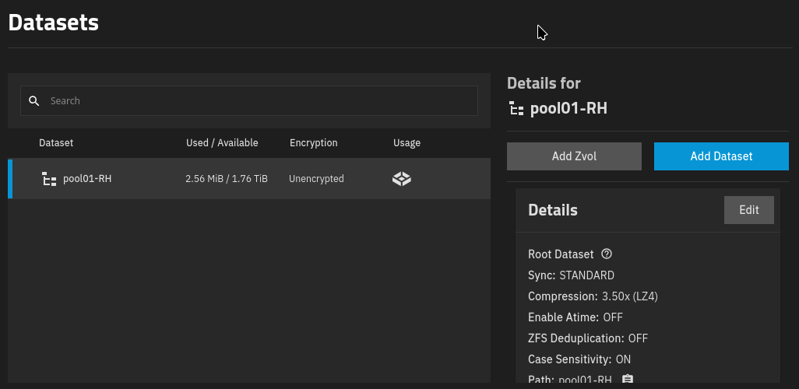

## Parte 2 - Grupos de almacenamiento y ZFS

### Descripción

En este ejercicio se aprenderán los conceptos fundamentales del almacenamiento en TrueNAS mediante **ZFS**, incluyendo la creación de pools de almacenamiento, datasets, vdevs y la configuración de propiedades como compresión, cuotas y reservas. El objetivo es comprender cómo ZFS proporciona integridad de datos, protección contra fallos y administración flexible del almacenamiento.

### Pool (agrupación o pool)

Un volumen de ZFS se denomina **pool**. Un pool contiene uno o más **vdevs**, abreviatura de *virtual device* (dispositivo virtual) [puedes revisar en el anterior capitulo](https://libialany.github.io/#/nivel1/parte1)

### Datasets (conjuntos de datos)

Un **dataset** es un sistema de archivos de ZFS. Puede verse como una construcción que combina las ventajas de un directorio tradicional (los datasets forman un árbol, comparten espacio del pool subyacente, etc.) con las ventajas de una partición de disco (los datasets pueden tratarse por separado y utilizarse para particionar el almacenamiento), además de añadir capacidades únicas de administración.

Cada pool de ZFS tiene un dataset de nivel superior, cuyo nombre es el mismo que el del pool. A partir de ahí, se puede crear un número arbitrario de datasets como hijos de un dataset existente. Los datasets suelen ser la unidad de administración; es decir, **las propiedades de ZFS se aplican a los datasets**. Estas propiedades incluyen características como compresión, sumas de comprobación (*checksums*), cuotas y reservas⁶. Las instantáneas (*snapshots*) y la replicación de ZFS, explicadas más adelante, también funcionan sobre datasets completos.

La regla general es utilizar **datasets en lugar de simples directorios** para los datos que se gestionan de forma diferente: distinto propietario, diferente programación de snapshots, diferente compresión, diferente cuota, etc. En caso de duda, normalmente es mejor utilizar más datasets que menos.

### Snapshots (instantáneas)

Una de las características más útiles de ZFS son las **instantáneas (*snapshots*)**. Un snapshot es el estado de un dataset en el momento en que se tomó la instantánea. Como ZFS utiliza el mecanismo **copy-on-write (COW)**, los snapshots son «gratuitos», en el sentido de que es posible tener, en esencia, una cantidad arbitraria de snapshots sin impacto en el rendimiento, aparte del espacio que ocupan las propias instantáneas⁸.

Una vez que existe un snapshot, es posible consultar el contenido del dataset tal como estaba en el momento en que se tomó la instantánea, así como **hacer rollback al snapshot** para revertir cualquier cambio realizado en el dataset desde entonces.

Los snapshots también pueden **clonarse**. Este proceso crea un nuevo dataset basado en el snapshot, lo que permite tener múltiples datasets derivados de uno solo y almacenar únicamente los cambios realizados desde que se creó el clon.

Los snapshots y los clones se utilizan para gestionar **entornos de arranque** en sistemas que arrancan desde ZFS, como FreeNAS, permitiendo revertir fácilmente actualizaciones que hayan salido mal.

Y, lo que es crucial, los snapshots **mitigan eficazmente tanto los ataques de ransomware como muchas formas de error del usuario**. Si se elimina un archivo importante, simplemente se puede restaurar desde el snapshot. Si todo el datas...

## Preguntas

¿Qué es un vdev y qué sucede con el pool de ZFS cuando se pierde un vdev?

¿Qué son los snapshots de ZFS y cómo pueden ayudar a recuperar datos después de un error del usuario o un ataque de ransomware?

**Referencias:**

1. Documentación oficial de TrueNAS sobre pools y ZFS:
   [https://www.truenas.com/docs/scale/scaletutorials/storage/](https://www.truenas.com/docs/scale/scaletutorials/storage/)

2. Documentación oficial de OpenZFS sobre conceptos de almacenamiento:
   [https://openzfs.org/wiki/Main_Page](https://openzfs.org/wiki/Main_Page)
