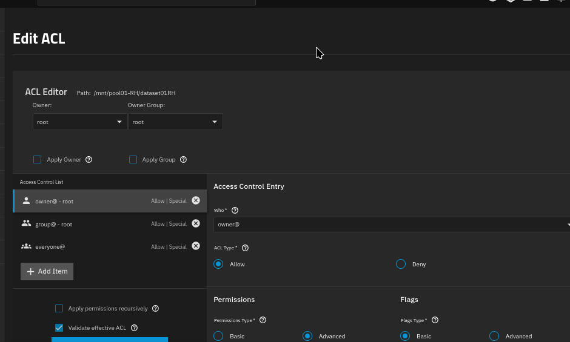

## Parte 3 - Usuarios, grupos y permisos

### Descripción

En este ejercicio se configurará la administración de usuarios y grupos en TrueNAS. Se practicarán la creación de cuentas, asignación de grupos, permisos sobre datasets y control de acceso mediante ACL. El objetivo es aprender a implementar una estructura segura para usuarios y recursos compartidos.

### Credenciales

- Dashboard

### Creacion de ACL

## Ejercicio 

Objetivo: Crear un usuario en el grupo lectores, y dar permisos de solo lectura sobre el dataset del Ejercicio 

Paso 1: 

Ir a Credentials → Users → Add:
Username: <tunombre>_lectura
Password: <tudecides>
Auxiliary Groups: agregar lectores
Shell: nologin (no necesita consola)

Paso 2:

Ir al dataset creado en el Ejercicio 1 -> Edit Permissions (o Permissions en la nueva UI).
Cambiar el Group Owner a lectores.

**Referencias:**

1. Administración de usuarios y grupos en TrueNAS:
   [https://www.truenas.com/docs/scale/scaletutorials/credentials/](https://www.truenas.com/docs/scale/scaletutorials/credentials/)

2. Guía de permisos y ACL en TrueNAS:
   [https://www.truenas.com/docs/scale/scaletutorials/shares/](https://www.truenas.com/docs/scale/scaletutorials/shares/)
