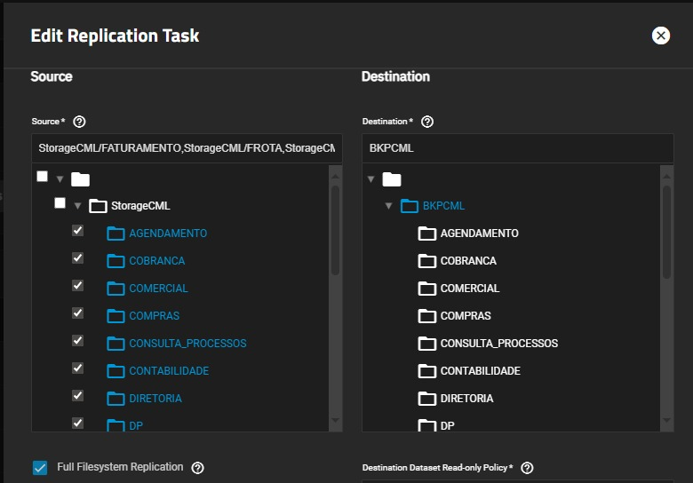

## Parte 5 - Instantáneas y replicación

### Descripción

En este ejercicio se implementará una estrategia de protección de datos utilizando **snapshots ZFS** y replicación. Se aprenderá cómo crear puntos de recuperación, programar instantáneas automáticas y replicar información hacia otro sistema TrueNAS para recuperación ante desastres.

### Configurar Replicacion

**Referencias:**

1. Documentación de snapshots en TrueNAS:
   [https://www.truenas.com/docs/scale/scaletutorials/dataprotection/](https://www.truenas.com/docs/scale/scaletutorials/dataprotection/)

2. Documentación de replicación ZFS en TrueNAS:
   [https://www.truenas.com/docs/scale/scaletutorials/dataprotection/replication/](https://www.truenas.com/docs/scale/scaletutorials/dataprotection/replication/)
