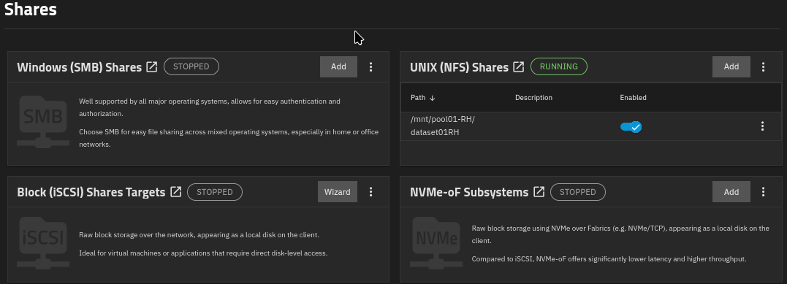
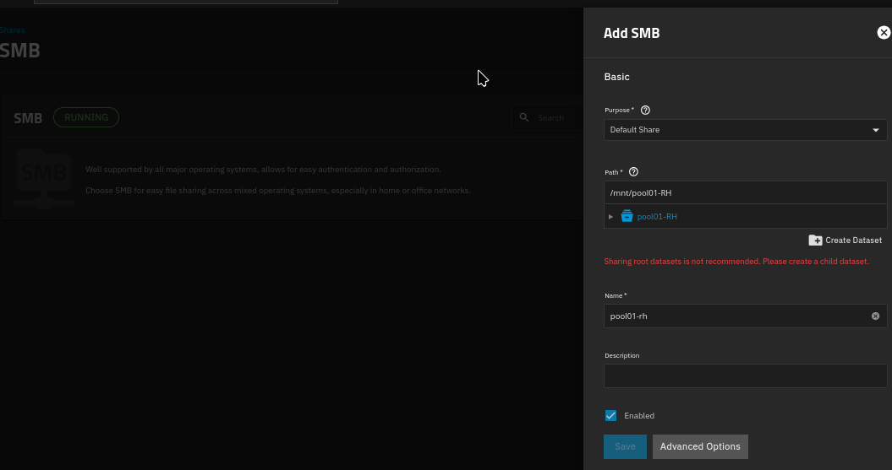
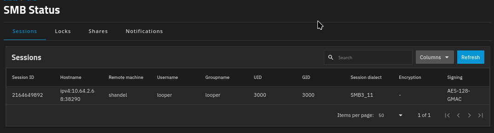
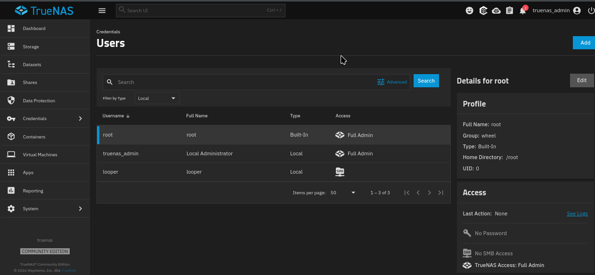

## Parte 4 - Uso compartido SMB/NFS

### Descripción

En este ejercicio se configurarán servicios de compartición de archivos utilizando los protocolos **SMB (Windows)** y **NFS (Linux/Unix)**. Los participantes aprenderán a crear recursos compartidos, aplicar permisos y conectar clientes externos al almacenamiento TrueNAS.
Todo esto lo encuentras en la seccion:

**System → Services → NFS**

Este es la imagen del resultado.


Ahora empecemos....

### Configuracion de accesos(users, grupos, dataset)


### Panel para compartir



### Configurar la carpeta a compartir



### Estatus



### Permitir a usuario 



### Ejercicio

Objetivo: Exponer el dataset del Ejercicio 1 vía NFS.

Pasos:

Paso 1.

Path: /mnt/tank/rh-<tu_nombre>
Description: opcional
Maproot User/Group: dejar vacío para empezar
Networks/Hosts: si quieren restringir, agregar la subred del laboratorio (ej. 192.168.1.0/24); si no, dejar abierto para el ejercicio

Paso 2.

```
   sudo mkdir -p /mnt/prueba
   sudo mount -t nfs <ip_truenas>:/mnt/tank/workshop-<tu_nombre> /mnt/prueba
```


**Referencias:**

1. Configuración de recursos compartidos SMB en TrueNAS:
   [https://www.truenas.com/docs/scale/scaletutorials/shares/smb/](https://www.truenas.com/docs/scale/scaletutorials/shares/smb/)

2. Configuración de recursos compartidos NFS en TrueNAS:
   [https://www.truenas.com/docs/scale/scaletutorials/shares/nfs/](https://www.truenas.com/docs/scale/scaletutorials/shares/nfs/)
