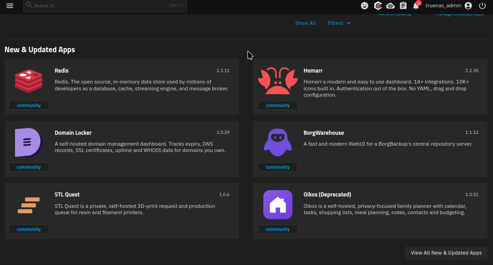
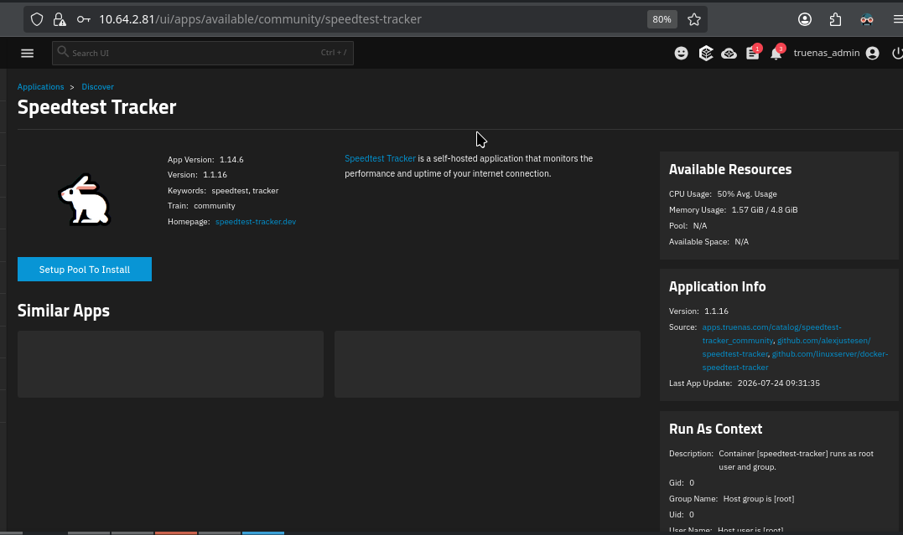
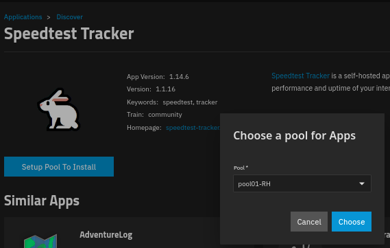
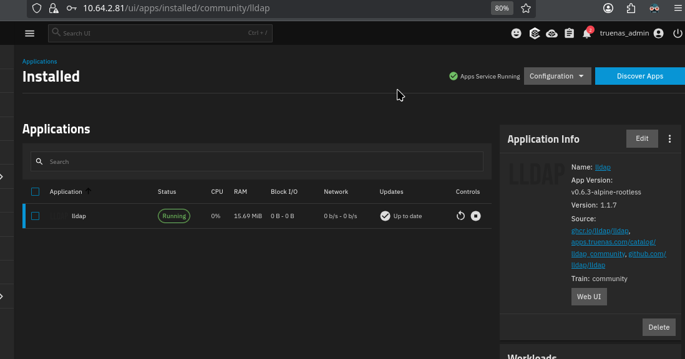
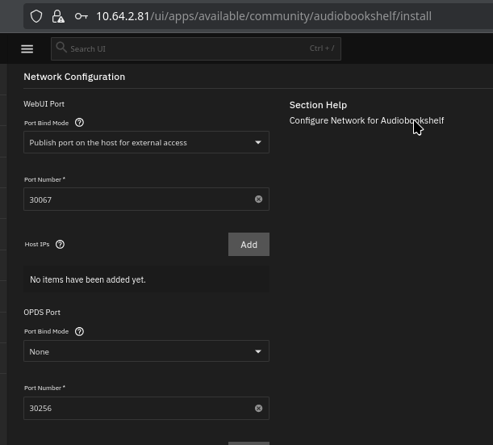

## Parte 6 - Aplicaciones y contenedores

### Descripción

En este ejercicio se explorará la ejecución de aplicaciones en TrueNAS mediante contenedores. Se aprenderá a desplegar servicios adicionales, configurar almacenamiento persistente y administrar aplicaciones dentro del entorno TrueNAS SCALE.

### Apps

### Descripcion de la aplicacion

### Seleccionar Pool

### Panel de aplicaciones

### Probar la Aplicacion de LDAP

**Referencias:**

1. Documentación de aplicaciones en TrueNAS SCALE:
   [https://www.truenas.com/docs/scale/scaletutorials/apps/](https://www.truenas.com/docs/scale/scaletutorials/apps/)

2. Documentación oficial de contenedores Docker:
   [https://docs.docker.com/get-started/](https://docs.docker.com/get-started/)
